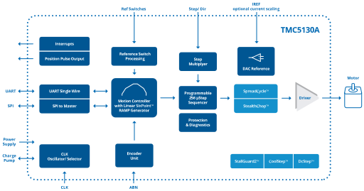

Silent stepper motor cDriver 4.75 to 46V, up to 1.4ARMS with SPI Interface, 256 µSteps, SixPoint ramp controller, SpreadCycle and Stealthchop 

---

[{ width="800" style="display: block; margin: auto;" }](../image/tmc5160_block_diagram.svg)

<em>TMC5130 Block Diagram — detailed overview of block architecture</em>

---
<a href="/hardware/datasheets/TMC5130A_datasheet.pdf" target="_blank">
  
  TMC5130 Datasheet
</a>

<a href="https://www.analog.com/en/products/tmc5130.html" target="_blank">
  
  TMC5130 Official Website
</a>

---
###  **Key Features**

- 2-phase stepper motors up to 2A coil current (2.5A peak)
- Voltage Range 4.75 to 46V DC
- Motion Controller with sixPoint™ ramp
- Step/Dir Interface with microstep interpolation MicroPlyer™
- SPI & Single Wire UART
- Encoder Interface and 2x Ref.-Switch Input
- Highest Resolution 256 microsteps per full step
- StealthChop™ for extremely quiet operation and smooth motion
- Compact Size 7x7mm2
- SpreadCycle™ highly dynamic motor control chopper
- DcStep™ load dependent speed control
- StallGuard2™ high precision sensorless motor load detection
- CoolStep™ current control for energy savings up to 75%
- Integrated Current Sense Option
- Passive Braking and freewheeling mode
- Full Protection & Diagnostics
- TQFP48 package

